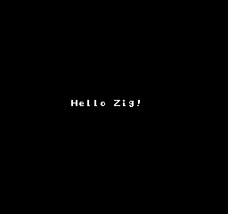
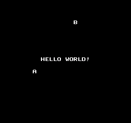
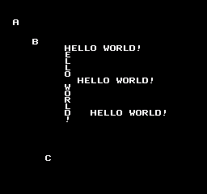
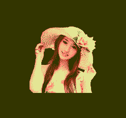
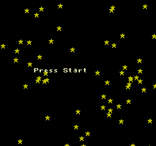
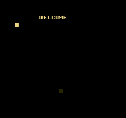
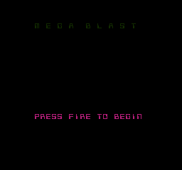
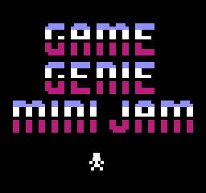
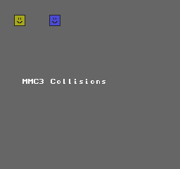
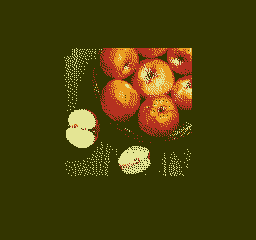

[](https://github.com/kassane/zig-mos-examples/actions/workflows/ci.yml)
[](https://deepwiki.com/kassane/zig-mos-examples)

# zig-mos-examples

Zig examples targeting MOS 6502 platforms via [zig-mos-bootstrap](https://github.com/kassane/zig-mos-bootstrap) and [llvm-mos-sdk](https://github.com/llvm-mos/llvm-mos-sdk).

## Requirements

- [zig-mos-bootstrap](https://github.com/kassane/zig-mos-bootstrap/releases) — Zig toolchain with LLVM-MOS backend

## Build

```sh
git clone https://github.com/kassane/zig-mos-examples.git
cd zig-mos-examples
zig build --summary all
```

Named steps (build one at a time):

```sh
# NES
zig build nes-hello1
zig build nes-hello2
zig build nes-hello3
zig build nes-zig-logo
zig build nes-fade
zig build nes-sprites
zig build nes-pads
zig build nes-color-cycle
zig build nes-fullbg
zig build nes-random
zig build nes-bat-ball
zig build nes-megablast
zig build nes-gg-demo
zig build nes-mappers
zig build nes-cnrom-hello
zig build nes-cnrom-sprites
zig build nes-unrom-hello
zig build nes-unrom-color-cycle
zig build nes-mmc1-hello
zig build nes-mmc1-sprites
zig build nes-mmc3-hello
zig build nes-mmc3-pads
zig build nes-gtrom-hello
zig build nes-gtrom-color-cycle
zig build nes-unrom-512-hello
zig build nes-action53-hello
zig build fds-hello

# Commodore 64
zig build c64-hello
zig build c64-fibonacci
zig build c64-plasma

# Commodore 128
zig build c128-hello

# Commodore PET
zig build pet-hello

# Supervision
zig build supervision-hello

# Dodo
zig build dodo-hello

# Commander X16
zig build cx16-hello
zig build cx16-k-console-test
zig build vic20-hello

# Atari Lynx
zig build lynx-hello

# Atari 2600
zig build atari2600-colorbar
zig build atari2600-3e-colorbar

# Atari 8-bit
zig build atari8dos-hello
zig build atari8-cart-hello
zig build atari5200-cart-hello
zig build atari8-megacart-hello
zig build atari8-xegs-hello

# GEOS-CBM
zig build geos-hello

# PC Engine
zig build pce-color-cycle
zig build pce-color-cycle-banked

# Neo6502
zig build neo6502-graphics

# SNES
zig build snes-hello
zig build snes-color-cycle
zig build snes-zig-logo
zig build snes-pi-test
zig build snes-pi-fastrom
zig build snes-hirom-hello
zig build snes-pads

# mos-sim (6502 simulator)
zig build sim-hello
```

Optional platforms:

```sh
# Ben Eater 6502
zig build eater-hello-lcd
zig build eater-asm-clobber

# MEGA65 — mega65-libc fetched automatically via build.zig.zon
zig build mega65-hello
zig build mega65-plasma
zig build mega65-viciv

# Apple II — dependency fetched automatically via build.zig.zon
zig build apple2-hello
```

Output files land in `zig-out/bin/`.

## Gallery

### NES

| Example | Preview |
|---------|---------|
| `nes-zig-logo` — Zig mark logo with shimmer palette animation |  |
| `nes-hello1` — text hello-world (NROM) |  |
| `nes-hello2` — text hello-world variant 2 |  |
| `nes-hello3` — text hello-world variant 3 |  |
| `nes-fade` — full-screen palette fade in/out |  |
| `nes-fullbg` — full background with metatiles | |
| `nes-sprites` — OAM sprite rendering | |
| `nes-random` — 64 sprites at random positions, three fall speeds |  |
| `nes-bat-ball` — bat-and-ball game loop (CH05 port) |  |
| `nes-megablast` — full-game [no sound] (CH13 port) |  |
| `nes-gg-demo` — Game Genie demo: metatile font, scrolling, player physics |  |
| `nes-color-cycle` — background colour cycling | |
| `nes-pads` — controller input with two 16×16 metasprites |  |
| `nes-mappers` — CNROM 4-bank CHR demo, press Start to cycle banks |  |
| `nes-cnrom-hello` — CNROM banked CHR ROM | |
| `nes-cnrom-sprites` — CNROM sprites example | |
| `nes-unrom-hello` — UNROM banked PRG ROM | |
| `nes-unrom-color-cycle` — UNROM colour-cycle across PRG banks | |
| `nes-mmc1-hello` — MMC1 mapper | |
| `nes-mmc1-sprites` — MMC1 sprites with CHR RAM upload | |
| `nes-mmc3-hello` — MMC3 mapper | |
| `nes-mmc3-pads` — MMC3 controller + collision example |  |
| `nes-gtrom-hello` — GTROM mapper | |
| `nes-gtrom-color-cycle` — GTROM colour-cycle with LED | |
| `nes-unrom-512-hello` — UNROM-512 mapper (mapper 30) | |
| `nes-action53-hello` — Action53 multicart (mapper 28) | |
| `fds-hello` — Famicom Disk System backdrop hello | |

### SNES

| Example | Preview |
|---------|---------|
| `snes-hello` — LoROM backdrop hello | |
| `snes-zig-logo` — Zig mark logo on BG1 with shimmer palette animation |  |
| `snes-color-cycle` — backdrop hue rotation (192-step colour wheel) | |
| `snes-pi-test` — ~900 digits of π via Spigot algorithm, BG1 text (port of pi_snes by Sirmacho) | |
| `snes-pi-fastrom` — same π demo built as FastROM (map mode $30, MEMSEL=1) | |
| `snes-hirom-hello` — HiROM backdrop hello (map mode $21) | |
| `snes-pads` — joypad demo: LEFT/RIGHT cycles backdrop color, A+B resets; exercises `buttonMask`, `held`, `pressed` | |

### Other platforms

| Example | Preview |
|---------|---------|
| `c64-plasma` — Commodore 64 plasma effect | |
| `pce-color-cycle-banked` — PC Engine banked colour cycle | |
| `atari2600-colorbar` — Atari 2600 colour bars | |

## Platforms

| Step | Platform | CPU | Output |
|------|----------|-----|--------|
| `nes-hello1`, `nes-hello2`, `nes-hello3` | NES NROM | mos6502 | `.nes` |
| `nes-zig-logo` | NES NROM | mos6502 | `.nes` |
| `nes-fade` | NES NROM | mos6502 | `.nes` |
| `nes-fullbg` | NES NROM | mos6502 | `.nes` |
| `nes-sprites` | NES NROM | mos6502 | `.nes` |
| `nes-random` | NES NROM | mos6502 | `.nes` |
| `nes-pads` | NES NROM | mos6502 | `.nes` |
| `nes-color-cycle` | NES NROM | mos6502 | `.nes` |
| `nes-bat-ball` | NES NROM | mos6502 | `.nes` |
| `nes-megablast` | NES NROM | mos6502 | `.nes` |
| `nes-gg-demo` | NES NROM | mos6502 | `.nes` |
| `nes-mappers` | NES CNROM (4-bank) | mos6502 | `.nes` |
| `nes-cnrom-hello` | NES CNROM | mos6502 | `.nes` |
| `nes-cnrom-sprites` | NES CNROM sprites | mos6502 | `.nes` |
| `nes-unrom-hello` | NES UNROM | mos6502 | `.nes` |
| `nes-unrom-color-cycle` | NES UNROM colour-cycle | mos6502 | `.nes` |
| `nes-mmc1-hello` | NES MMC1 | mos6502 | `.nes` |
| `nes-mmc1-sprites` | NES MMC1 sprites (CHR RAM) | mos6502 | `.nes` |
| `nes-mmc3-hello` | NES MMC3 | mos6502 | `.nes` |
| `nes-mmc3-pads` | NES MMC3 controller + collision | mos6502 | `.nes` |
| `nes-gtrom-hello` | NES GTROM | mos6502 | `.nes` |
| `nes-gtrom-color-cycle` | NES GTROM colour-cycle + LED | mos6502 | `.nes` |
| `nes-unrom-512-hello` | NES UNROM-512 | mos6502 | `.nes` |
| `nes-action53-hello` | NES Action53 (mapper 28) | mos6502 | `.nes` |
| `fds-hello` | Famicom Disk System | mos6502 | `.fds` |
| `c64-hello`, `c64-fibonacci` | Commodore 64 | mos6502 | `.prg` |
| `c64-plasma` | Commodore 64 | mos6502 | `.prg` |
| `vic20-hello` | Commodore VIC-20 (24K) | mos6502 | `.prg` |
| `c128-hello` | Commodore 128 | mos6502 | `.prg` |
| `pet-hello` | Commodore PET | mos6502 | `.prg` |
| `supervision-hello` | Watara Supervision | mos65c02 | `.sv` |
| `dodo-hello` | Dodo | mos65c02 | (raw) |
| `cx16-hello` | Commander X16 | mosw65c02 | `.prg` |
| `cx16-k-console-test` | Commander X16 | mosw65c02 | `.prg` |
| `lynx-hello` | Atari Lynx | mos6502 | `.bll` |
| `atari2600-colorbar` | Atari 2600 | mos6502 | `.a26` |
| `atari2600-3e-colorbar` | Atari 2600 (3E) | mos6502 | `.a26` |
| `atari8dos-hello` | Atari 8-bit DOS | mos6502 | `.xex` |
| `atari8-cart-hello` | Atari 8-bit cart | mos6502 | `.rom` |
| `atari5200-cart-hello` | Atari 5200 cart | mos6502 | `.rom` |
| `atari8-megacart-hello` | Atari 8-bit MegaCart | mos6502 | `.rom` |
| `atari8-xegs-hello` | Atari 8-bit XEGS cart | mos6502 | `.rom` |
| `geos-hello` | GEOS-CBM | mos6502 | `.cvt` |
| `pce-color-cycle` | PC Engine | mosw65c02 | `.pce` |
| `pce-color-cycle-banked` | PC Engine banked | mosw65c02 | `.pce` |
| `neo6502-graphics` | Neo6502 | mosw65c02 | `.neo` |
| `snes-hello` | SNES LoROM | mosw65816 | `.sfc` |
| `snes-color-cycle` | SNES LoROM | mosw65816 | `.sfc` |
| `snes-zig-logo` | SNES LoROM | mosw65816 | `.sfc` |
| `snes-pi-test` | SNES LoROM | mosw65816 | `.sfc` |
| `snes-pi-fastrom` | SNES FastROM | mosw65816 | `.sfc` |
| `snes-hirom-hello` | SNES HiROM | mosw65816 | `.sfc` |
| `snes-pads` | SNES LoROM | mosw65816 | `.sfc` |
| `sim-hello` | mos-sim (6502 simulator) | mos6502 | binary |
| `eater-hello-lcd` | Ben Eater 6502 LCD | mosw65c02 | `.rom` |
| `eater-asm-clobber` | Ben Eater 6502 asm clobber test | mosw65c02 | `.rom` |
| `mega65-hello`, `mega65-plasma` | MEGA65 | mos45gs02 | `.prg` |
| `mega65-viciv` | MEGA65 VICIV | mos45gs02 | `.prg` |
| `apple2-hello` | Apple IIe ProDOS | mos6502 | `.sys` |

## sim-hello benchmark

Build and run in one step (no prebuilt `mos-sim` binary required):

```sh
zig build run-sim-hello
```

Or build the simulator separately first:

```sh
zig build build-mos-sim   # compiles mos-sim from llvm-mos-sdk source
zig build sim-hello
zig-out/bin/mos-sim zig-out/bin/sim-hello
```

```
mos-sim benchmarks
==================
fib(10) =     55  (   7 cycles)
fib(20) =   6765  (   4 cycles)
sieve<127>: 31 primes  (6905 cycles)
```

## Host tools

Built automatically alongside the examples (`zig build --summary all`).

### `bininfo` — binary inspector

Identifies and inspects any MOS-platform output binary.

```sh
zig-out/bin/bininfo <file> [files…] [flags]
```

| Flag | Short | Description |
|------|-------|-------------|
| `--sections` | `-S` | List ELF sections |
| `--symbols` | `-n` | List ELF symbols |
| `--dwarf` | `-d` | Dump DWARF section inventory, CU headers, and subprogram listing |
| `--xxd` | `-x` | Hex+ASCII dump (xxd style) |
| `--xxd-limit N` | | Cap xxd output at N bytes |
| `--disasm` | `-D` | 6502 disassembly of file payload |

Flags may appear before or after filenames.

Detected formats: iNES 1.0/2.0 (`.nes`), SNES SFC/SMC (`.sfc`/`.smc` — SMC 512-byte copier header auto-stripped), FDS raw (`.fds`), GEOS CVT (`.cvt`), CBM PRG (`.prg`), Atari 2600 (`.a26`), Atari 8-bit cart (`.rom`), Atari XEX (`.xex`), Lynx BLL (`.bll`), PC Engine (`.pce`), Watara Supervision (`.sv`), Neo6502 (`.neo`), Apple IIe ProDOS (`.sys`), mos-sim binary, ELF. HiROM vs LoROM is auto-detected from map-mode byte.

```sh
# Inspect a built NES ROM
bininfo zig-out/bin/hello1.nes --sections

# Dump first 64 bytes of an FDS binary
bininfo zig-out/bin/fds-hello.fds -x --xxd-limit 64

# Disassemble a PRG (auto-skips 2-byte load-address header)
bininfo zig-out/bin/c64-hello.prg -D
```

### `romtool` — NES / SNES ROM analyser

```sh
zig-out/bin/romtool <subcommand> [options] <file>
```

| Subcommand | Description |
|------------|-------------|
| `disasm` | 6502 / 65816 disassembly |
| `unpack` | Extract PRG/CHR banks + `header.txt` |
| `pack nes` | Assemble PRG+CHR banks back into an iNES ROM |
| `pack snes` | Assemble bank binaries into an SFC ROM with correct checksum |

**`disasm` options:**

| Flag | Description |
|------|-------------|
| `--bank N` | NES: PRG bank N (16 KB, 0-based); SNES: 32 KB bank N (0-based) |
| `--base 0xNNNN` | Override load address displayed |
| `--offset N` | Skip N bytes before disassembling (address adjusts automatically) |
| `--length N` | Disassemble at most N bytes |
| `--m8` / `--x8` | SNES: start with M/X flags set (8-bit accumulator/index) |

```sh
# Disassemble NES PRG bank 1 from offset $1234
romtool disasm game.nes --bank 1 --base 0xC000 --offset 0x1234 --length 128

# Disassemble SNES RESET vector (HiROM, bank 1, offset $7F98)
romtool disasm game.smc --bank 1 --base 0x8000 --offset 0x7F98 --m8 --x8 --length 40

# Unpack all banks to a directory
romtool unpack game.nes /path/to/game-banks/

# Reassemble NES ROM from PRG + CHR binaries
romtool pack nes -o repacked.nes prg-bank-00.bin chr-bank-00.bin

# Assemble SNES ROM from 32KB bank binaries (checksum auto-computed)
romtool pack snes -o out.sfc --map lorom bank-00.bin [bank-01.bin ...]

# Same with SMC copier header and custom title
romtool pack snes -o out.smc --map hirom --title "MY GAME" --smc bank-00.bin
```

### `chr2svg` / `svg2chr` — NES CHR tile converter

```sh
# CHR ROM → SVG (view/edit tiles in any SVG editor)
chr2svg zig-out/bin/chr-bank-00.bin tiles.svg --scale 3 --cols 16

# SVG → CHR ROM (after editing)
svg2chr tiles.svg chr-bank-00.bin
```

### `svgcheck` — SVG tile validator

Checks that an SVG tile file is well-formed and compatible with `svg2chr` (correct viewBox, pixel dimensions, tile count).

```sh
svgcheck tiles.svg
```

### `elf2mlb` — Mesen label file generator

Converts a MOS ELF debug binary to a Mesen `.mlb` label file for source-level symbol display in the Mesen emulator debugger.

```sh
elf2mlb zig-out/bin/hello1.nes hello1.mlb hello1.nes.elf
```

The `gen-labels` build step runs this automatically for all NES examples.

## Platform notes

- **NES mappers** — CNROM 4-bank CHR demo; press Start to cycle through 4 CHR banks with distinct palettes. ROM: 32 KB PRG + 32 KB CHR ROM (4×8 KB banks).
- **NES CNROM hello** — uses translated `mapper.h` via `b.addTranslateC`; calls `set_chr_bank(0)` to initialise the CNROM CHR bank. ROM: 32 KB PRG + 8 KB CHR ROM.
- **NES CNROM sprites** — CNROM OAM sprite rendering with banked CHR. ROM: 32 KB PRG + 8 KB CHR ROM.
- **NES UNROM hello** — uses translated `mapper.h`; calls `set_prg_bank(0)` to initialise the UNROM PRG bank. ROM: 256 KB PRG + 8 KB CHR RAM.
- **NES UNROM colour-cycle** — cycles backdrop colour across multiple UNROM PRG banks. ROM: 256 KB PRG + CHR RAM.
- **NES MMC1 hello** — uses translated `mapper.h`; calls `set_prg_bank(0)` and `set_mirroring(MIRROR_VERTICAL)` to initialise MMC1 registers. ROM: 256 KB PRG + 8 KB CHR RAM.
- **NES MMC1 sprites** — MMC1 OAM sprites with 8 KB CHR uploaded to CHR RAM via `vram_write`; calls `set_mmc1_ctrl(0x0E)` first to set 8 KB CHR mode.
- **NES MMC3 hello** — uses translated `mapper.h`; calls `set_prg_bank(0)` to initialise MMC3 PRG bank. ROM: 512 KB PRG + CHR RAM.
- **NES MMC3 pads** — MMC3 controller input + sprite-background collision; uploads CHR tiles to CHR RAM.
- **NES GTROM hello** — uses translated `mapper.h`; GTROM (Codemasters) flash mapper. ROM: 512 KB PRG flash.
- **NES GTROM colour-cycle** — GTROM PRG bank cycling with LED toggle via `$5000` write.
- **NES UNROM-512 hello** — uses translated `mapper.h`; calls `set_prg_bank(0)` and `set_chr_bank(0)` to initialise mapper 30 registers. ROM: 512 KB PRG + 32 KB CHR RAM.
- **NES Action53 hello** — uses translated `mapper.h`; mapper 28 (Action53 multicart). ROM: 64 KB PRG + 8 KB CHR RAM.
- **FDS hello** — Famicom Disk System; uses raw PPU register writes via `nes/hardware.zig` (no neslib — FDS has no CHR ROM, raw PPU only). Writes dark-green backdrop (`$1A`) to palette `$3F00`.
- **VIC-20 hello** — uses CBM KERNAL `cbm_k_chrout` to print "HELLO VIC20!", then cycles VIC chip background/border colour register (`$900F`). Targets 24K memory expansion, loads at `$1201`.
- **C64 hello** — uses translated `c64.h` (VIC-II typed struct) via `b.addTranslateC`; cycles VIC-II border colour register.
- **CX16 hello** — uses CBM KERNAL `cbm_k_chrout` to print "HELLO X16!", then cycles the border colour register.
- **Lynx hello** — uses translated `_mikey.h` (MIKEY typed struct) via `b.addTranslateC`; animates all 32 palette entries.
- **SNES FastROM** — same π demo as `snes-pi-test` built with map mode `$30` (FastROM) and MEMSEL=1; ROM mirrored at `$80:8000`, runs at full 3.58 MHz.
- **SNES HiROM** — 64 KB bank layout with header at `$FFC0`; data bank register forced to `$00` via `lda #$00; pha; plb` in crt0 (safe for both LoROM and HiROM).
- **Atari 8-bit DOS hello** — uses `std.c.printf` via CIO-backed libc (E: screen editor device).
- **Atari 8-bit cart hello** — uses translated `_gtia.h` (GTIA write struct) via `b.addTranslateC`; cycles COLBK background colour, synced to ANTIC VCOUNT.
- **Atari 5200 cart hello** — cycles GTIA COLBK register (`$C01A`) through all hues via direct `*volatile u8` write. No CIO/stdio on 5200; pure hardware register loop.
- **Atari 8-bit MegaCart hello** — uses translated `_gtia.h`; cycles COLBK synced to ANTIC VCOUNT. MegaCart bank 0 is selected at cold start via the SDK's `tail0.s` stub before `main()` runs.
- **Atari 8-bit XEGS hello** — same GTIA colour-cycle as MegaCart but targeting the XEGS cartridge format; XEGS `_cart_init` writes `$D500` to select bank 0 before `main()` runs.
- **GEOS-CBM hello** — uses GEOS kernel jump-table entries (`__GraphicsString`, `__PutString`, `__UseSystemFont`, `__MainLoop`) as `extern fn` declarations resolved by `geos.ld`; passes arguments via zero-page registers `__r0` (`$0002`) and `__r11` (`$0018`). Output is a `.cvt` VLIR-formatted GEOS application file, verified by `03 00 FF` + `llvm-mos VLIR` magic at offset `$00`.
- **sim-hello** — uses translated `sim-io.h` (typed MMIO struct) via `b.addTranslateC`; benchmarks fib(10), fib(20), and sieve of Eratosthenes for primes < 128.

## References

- [Nesdoug LLVM-MOS tutorial](https://github.com/mysterymath/nesdoug-llvm)
- [llvm-mos-sdk examples](https://github.com/llvm-mos/llvm-mos-sdk/tree/main/examples)
- [rust-mos-hello-world](https://github.com/mrk-its/rust-mos-hello-world)

## License

Apache 2.0 — see LICENSE.
