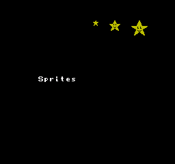
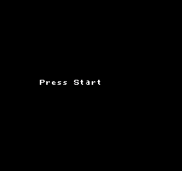
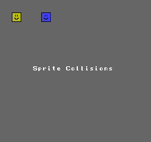

[](https://github.com/kassane/zig-mos-examples/actions/workflows/ci.yml)
[](https://deepwiki.com/kassane/zig-mos-examples)

# zig-mos-examples

Zig examples targeting MOS 6502 platforms via [zig-mos-bootstrap](https://github.com/kassane/zig-mos-bootstrap) and [llvm-mos-sdk](https://github.com/llvm-mos/llvm-mos-sdk).

## Requirements

- [zig-mos-bootstrap](https://github.com/kassane/zig-mos-bootstrap/releases) — Zig toolchain with LLVM-MOS backend

## Build

```sh
git clone https://github.com/kassane/zig-mos-examples.git
cd zig-mos-examples
zig build --summary all
```

Named steps (build one at a time):

```sh
# NES
zig build nes-hello1
zig build nes-hello2
zig build nes-hello3
zig build nes-zig-logo
zig build nes-fade
zig build nes-sprites
zig build nes-pads
zig build nes-color-cycle
zig build nes-fullbg
zig build nes-random
zig build nes-bat-ball
zig build nes-megablast
zig build nes-gg-demo
zig build nes-mappers
zig build nes-cnrom-hello
zig build nes-unrom-hello
zig build nes-mmc1-hello
zig build nes-mmc3-hello
zig build nes-gtrom-hello

# Commodore 64
zig build c64-hello
zig build c64-fibonacci
zig build c64-plasma

# Commander X16
zig build cx16-hello
zig build cx16-k-console-test

# Atari Lynx
zig build lynx-hello

# Atari 2600
zig build atari2600-colorbar
zig build atari2600-3e-colorbar

# Atari 8-bit
zig build atari8dos-hello
zig build atari8-cart-hello

# PC Engine
zig build pce-color-cycle
zig build pce-color-cycle-banked

# Neo6502
zig build neo6502-graphics

# SNES
zig build snes-hello
zig build snes-color-cycle
zig build snes-zig-logo

# mos-sim (6502 simulator)
zig build sim-hello
```

Optional platforms:

```sh
# MEGA65 — mega65-libc fetched automatically via build.zig.zon
zig build mega65-hello
zig build mega65-plasma
zig build mega65-viciv

# Apple II — dependency fetched automatically via build.zig.zon
zig build apple2-hello
```

Output files land in `zig-out/bin/`.

## Gallery

### NES

| Example | Preview |
|---------|---------|
| `nes-zig-logo` — Zig mark logo with shimmer palette animation |  |
| `nes-hello1` — text hello-world (NROM) |  |
| `nes-hello2` — text hello-world variant 2 |  |
| `nes-hello3` — text hello-world variant 3 |  |
| `nes-fade` — full-screen palette fade in/out |  |
| `nes-fullbg` — full background with metatiles | |
| `nes-sprites` — OAM sprite rendering |  |
| `nes-random` — 64 sprites at random positions, three fall speeds |  |
| `nes-bat-ball` — bat-and-ball game loop (CH05 port) | |
| `nes-megablast` — title screen + game screen (CH06 port) | |
| `nes-gg-demo` — Game Genie demo: metatile font, scrolling, player physics |  |
| `nes-color-cycle` — background colour cycling | |
| `nes-pads` — controller input with two 16×16 metasprites |  |
| `nes-mappers` — CNROM 4-bank CHR demo, press Start to cycle banks | |
| `nes-cnrom-hello` — CNROM banked CHR ROM | |
| `nes-unrom-hello` — UNROM banked PRG ROM | |
| `nes-mmc1-hello` — MMC1 mapper | |
| `nes-mmc3-hello` — MMC3 mapper | |
| `nes-gtrom-hello` — GTROM mapper | |

### SNES

| Example | Preview |
|---------|---------|
| `snes-zig-logo` — Zig mark logo on BG1 with shimmer palette animation | |
| `snes-color-cycle` — backdrop hue rotation (192-step colour wheel) | |

### Other platforms

| Example | Preview |
|---------|---------|
| `c64-plasma` — Commodore 64 plasma effect | |
| `pce-color-cycle-banked` — PC Engine banked colour cycle | |
| `atari2600-colorbar` — Atari 2600 colour bars | |

## Platforms

| Step | Platform | CPU | Output |
|------|----------|-----|--------|
| `nes-hello1`, `nes-hello2`, `nes-hello3` | NES NROM | mos6502 | `.nes` |
| `nes-zig-logo` | NES NROM | mos6502 | `.nes` |
| `nes-fade` | NES NROM | mos6502 | `.nes` |
| `nes-fullbg` | NES NROM | mos6502 | `.nes` |
| `nes-sprites` | NES NROM | mos6502 | `.nes` |
| `nes-random` | NES NROM | mos6502 | `.nes` |
| `nes-pads` | NES NROM | mos6502 | `.nes` |
| `nes-color-cycle` | NES NROM | mos6502 | `.nes` |
| `nes-bat-ball` | NES NROM | mos6502 | `.nes` |
| `nes-megablast` | NES NROM | mos6502 | `.nes` |
| `nes-gg-demo` | NES NROM | mos6502 | `.nes` |
| `nes-mappers` | NES CNROM (4-bank) | mos6502 | `.nes` |
| `nes-cnrom-hello` | NES CNROM | mos6502 | `.nes` |
| `nes-unrom-hello` | NES UNROM | mos6502 | `.nes` |
| `nes-mmc1-hello` | NES MMC1 | mos6502 | `.nes` |
| `nes-mmc3-hello` | NES MMC3 | mos6502 | `.nes` |
| `nes-gtrom-hello` | NES GTROM | mos6502 | `.nes` |
| `c64-hello`, `c64-fibonacci` | Commodore 64 | mos6502 | `.prg` |
| `c64-plasma` | Commodore 64 | mos6502 | `.prg` |
| `cx16-hello` | Commander X16 | mosw65c02 | `.prg` |
| `cx16-k-console-test` | Commander X16 | mosw65c02 | `.prg` |
| `lynx-hello` | Atari Lynx | mos6502 | `.bll` |
| `atari2600-colorbar` | Atari 2600 | mos6502 | `.a26` |
| `atari2600-3e-colorbar` | Atari 2600 (3E) | mos6502 | `.a26` |
| `atari8dos-hello` | Atari 8-bit DOS | mos6502 | `.xex` |
| `atari8-cart-hello` | Atari 8-bit cart | mos6502 | `.rom` |
| `pce-color-cycle` | PC Engine | mosw65c02 | `.pce` |
| `pce-color-cycle-banked` | PC Engine banked | mosw65c02 | `.pce` |
| `neo6502-graphics` | Neo6502 | mosw65c02 | `.neo` |
| `snes-hello` | SNES LoROM | mosw65816 | `.sfc` |
| `snes-color-cycle` | SNES LoROM | mosw65816 | `.sfc` |
| `snes-zig-logo` | SNES LoROM | mosw65816 | `.sfc` |
| `sim-hello` | mos-sim (6502 simulator) | mos6502 | binary |
| `mega65-hello`, `mega65-plasma` | MEGA65 | mos45gs02 | `.prg` |
| `mega65-viciv` | MEGA65 VICIV | mos45gs02 | `.prg` |
| `apple2-hello` | Apple IIe ProDOS | mos6502 | `.sys` |

## sim-hello benchmark

Build and run in one step (no prebuilt `mos-sim` binary required):

```sh
zig build run-sim-hello
```

Or build the simulator separately first:

```sh
zig build build-mos-sim   # compiles mos-sim from llvm-mos-sdk source
zig build sim-hello
zig-out/bin/mos-sim zig-out/bin/sim-hello
```

```
mos-sim benchmarks
==================
fib(10) =     55  (   7 cycles)
fib(20) =   6765  (   4 cycles)
sieve<127>: 31 primes  (6905 cycles)
```

## Platform notes

- **NES mappers** — CNROM 4-bank CHR demo; press Start to cycle through 4 CHR banks with distinct palettes. ROM: 32 KB PRG + 32 KB CHR ROM (4×8 KB banks).
- **NES CNROM hello** — uses translated `mapper.h` via `b.addTranslateC`; calls `set_chr_bank(0)` to initialise the CNROM CHR bank. ROM: 32 KB PRG + 8 KB CHR ROM.
- **NES UNROM hello** — uses translated `mapper.h`; calls `set_prg_bank(0)` to initialise the UNROM PRG bank. ROM: 256 KB PRG + 8 KB CHR RAM.
- **NES MMC1 hello** — uses translated `mapper.h`; calls `set_prg_bank(0)` and `set_mirroring(MIRROR_VERTICAL)` to initialise MMC1 registers. ROM: 256 KB PRG + 8 KB CHR RAM.
- **NES MMC3 hello** — uses translated `mapper.h`; calls `set_prg_bank(0)` to initialise MMC3 PRG bank. ROM: 512 KB PRG + 256 KB CHR ROM.
- **NES GTROM hello** — uses translated `mapper.h`; GTROM (Codemasters) flash mapper. ROM: 512 KB PRG flash.
- **C64 hello** — uses translated `c64.h` (VIC-II typed struct) via `b.addTranslateC`; cycles VIC-II border colour register.
- **CX16 hello** — uses CBM KERNAL `cbm_k_chrout` to print "HELLO X16!", then cycles the border colour register.
- **Lynx hello** — uses translated `_mikey.h` (MIKEY typed struct) via `b.addTranslateC`; animates all 32 palette entries.
- **Atari 8-bit DOS hello** — uses `std.c.printf` via CIO-backed libc (E: screen editor device).
- **Atari 8-bit cart hello** — uses translated `_gtia.h` (GTIA write struct) via `b.addTranslateC`; cycles COLBK background colour, synced to ANTIC VCOUNT.
- **sim-hello** — uses translated `sim-io.h` (typed MMIO struct) via `b.addTranslateC`; benchmarks fib(10), fib(20), and sieve of Eratosthenes for primes < 128.

## References

- [Nesdoug LLVM-MOS tutorial](https://github.com/mysterymath/nesdoug-llvm)
- [llvm-mos-sdk examples](https://github.com/llvm-mos/llvm-mos-sdk/tree/main/examples)
- [rust-mos-hello-world](https://github.com/mrk-its/rust-mos-hello-world)

## License

Apache 2.0 — see LICENSE.
